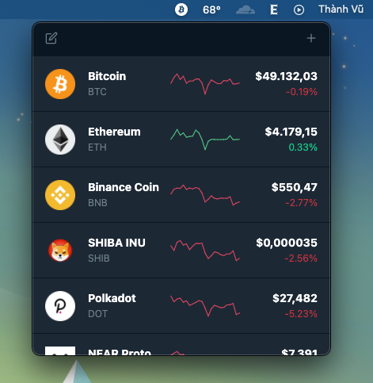

# Cryptocurrency Tracker

<p align="center">
  
</p>

## Overview

Monitor cryptocurrency prices.

<p align="center">
  
</p>

## Usage

```
  $ git clone
  $ yarn install
  $ yarn start
```

## Data source

- [CoinMarketCap](https://coinmarketcap.com/)

## Installation

 <a href="https://github.com/misa198/cryptocurrency-tracker/releases">
  
  </a>

## License

- [MIT](./LICENSE)
